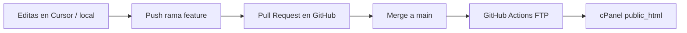

# Despliegue automático: GitHub → cPanel

Cuando haces **push** (o merge) a la rama `main`, GitHub Actions puede subir los archivos del sitio a tu hosting en **cPanel** por FTP.

Hay **dos formas**. La más simple si ya usas FTP es la **Opción A**.

---

## Opción A — GitHub Actions + FTP (recomendada)

### 1. Datos que necesitas de cPanel

En cPanel → **Cuentas FTP** (o **FTP Accounts**):

| Dato | Ejemplo |
|------|---------|
| Servidor / host | `ftp.tudominio.cl` o la IP del servidor |
| Usuario FTP | `usuario@tudominio.cl` |
| Contraseña | la de la cuenta FTP |
| Puerto | `21` (FTP) o el que indique tu hosting |
| Carpeta del sitio | `/public_html/` o `/public_html/subcarpeta/` |

La cuenta FTP debe apuntar a la carpeta donde está (o estará) tu web: normalmente `public_html`.

### 2. Crear secrets en GitHub

Repo → **Settings** → **Secrets and variables** → **Actions** → **New repository secret**

Crea estos secrets (nombres exactos):

| Secret | Valor |
|--------|--------|
| `CPANEL_FTP_HOST` | Host FTP, ej. `ftp.ditecno.cl` |
| `CPANEL_FTP_USERNAME` | Usuario FTP completo, ej. `Admin@trustmotors.cl` |
| `CPANEL_FTP_PASSWORD` | Contraseña FTP (solo en secret, nunca en el repo) |
| `CPANEL_FTP_PORT` | `21` para FTPS explícito (opcional; si no existe, usa 21) |
| `CPANEL_REMOTE_DIR` | Ver tabla abajo según cómo configuraste la cuenta FTP |

**Trust Motors (Ditecno):**

| Secret | Valor |
|--------|--------|
| `CPANEL_FTP_HOST` | `ftp.ditecno.cl` |
| `CPANEL_FTP_USERNAME` | `Admin@trustmotors.cl` |
| `CPANEL_FTP_PORT` | `21` |
| `CPANEL_FTP_PASSWORD` | Tu contraseña FTP |

**`CPANEL_REMOTE_DIR` (muy importante):**

| Configuración en cPanel → Cuentas FTP → Directorio de la cuenta | Valor del secret |
|----------------------------------------------------------------|------------------|
| Apunta a **`public_html/ditecnoc/trustmotors.cl`** (recomendado) | **`/`** |
| Apunta a la raíz del usuario y subes a mano a la subcarpeta | **`/public_html/ditecnoc/trustmotors.cl/`** |

Si la cuenta FTP ya abre directamente la carpeta de **trustmotors.cl**, usa **`/`**. Si usas `/public_html/...` cuando la cuenta ya está en esa carpeta, los archivos se suben a una ruta incorrecta o el deploy falla.

### 3. Activar el workflow

El archivo `.github/workflows/deploy-cpanel.yml` ya está en el repo.

1. Haz **merge** de ese archivo a `main` (o súbelo a GitHub).
2. Ve a **Actions** en GitHub.
3. Debería ejecutarse solo al pushear a `main`, o pulsa **Run workflow** (manual).

Si todo está bien, verás ✅ **Deploy to cPanel (FTP)** en verde.

### 4. Probar

1. Cambia algo pequeño (ej. un texto en `index.html`).
2. Commit y push a `main`.
3. Espera 1–3 minutos.
4. Abre tu dominio en el navegador con **Ctrl+Shift+R**.

### Problemas frecuentes

| Error | Qué hacer |
|-------|-----------|
| **530 Login authentication failed** | Ver sección **Error 530** abajo |
| Login incorrecto | Revisa usuario/contraseña FTP; en cPanel crea una cuenta FTP solo para deploy |
| Ruta incorrecta | `CPANEL_REMOTE_DIR` debe ser la carpeta del dominio, con barras `/` |
| Firewall | Algunos hostings exigen **IP fija** de GitHub Actions; en ese caso usa la **Opción B** (Git en cPanel) |
| FTPS requerido | El workflow usa `protocol: ftps` y puerto `21` (explícito). Si falla, prueba `ftp` sin cifrado o puerto `990` con `ftps-legacy` |
| Certificado TLS | Si el hosting usa certificado autofirmado, el workflow usa `security: loose` |
| **500 en `/admin/` o `/js/`** | Suele ser `.htaccess` roto en el servidor o ModSecurity. Usa **`https://tudominio.cl/panel.html`** (panel en la raíz) y **`finance-utils.js`** en la raíz. Tras el deploy, borra en cPanel (Administrador de archivos) cualquier `.htaccess` corrupto dentro de `admin/` o `js/` si sigue el error. |

### Panel y financiamiento en producción

- Panel: **`/panel.html`** (recomendado si `/admin/` da error 500).
- Cuota/crédito en publicaciones: requiere `finance-utils.js` en la raíz y columnas de financiamiento en Supabase (`sql/vehicles_financing.sql`).

---

## Opción B — Git nativo en cPanel + webhook

Si tu plan cPanel incluye **Git™ Version Control**:

### 1. Clonar el repo en cPanel

1. cPanel → **Git™ Version Control** → **Create**
2. Clone URL: `https://github.com/tomydominguez23/Motors-Y-Trust.git`
3. Repository Path: algo como `/home/TU_USUARIO/repos/motors-y-trust` (fuera de public_html)
4. **Deploy** a `public_html` (o subcarpeta): activa **Deploy HEAD** y define la ruta de publicación

### 2. Webhook en GitHub

1. Repo GitHub → **Settings** → **Webhooks** → **Add webhook**
2. Payload URL: la que te da cPanel al crear el repositorio (Pull / Deploy hook)
3. Content type: `application/json`
4. Evento: **Just the push event**
5. Secret: el que indique cPanel (si aplica)

Cada **push** a la rama que configuraste hará que cPanel haga **Pull** y actualice los archivos en `public_html`.

### Ventaja

No guardas la contraseña FTP en GitHub; el servidor tira del código directamente.

---

## Qué archivos se suben

El workflow FTP sube el sitio (HTML, CSS, JS, `admin/`, etc.) y **no** sube:

- `.git/`, `.github/`
- `docs/` (esta guía)
- `sql/` (solo scripts para Supabase; no hace falta en el servidor web)

Supabase sigue en la nube: no cambia por el deploy a cPanel.

---

## Flujo de trabajo recomendado

1. Trabaja en ramas `cursor/...` o `feature/...`
2. Abre **Pull Request** hacia `main`
3. Revisa y **Merge**
4. El deploy corre solo → tu dominio en cPanel se actualiza

---

## Desactivar GitHub Pages (opcional)

Si antes publicabas en `*.github.io` y ahora usas solo cPanel, en GitHub → **Settings** → **Pages** puedes poner **Source: None** para evitar confusiones. El sitio “oficial” queda solo en tu dominio de cPanel.
